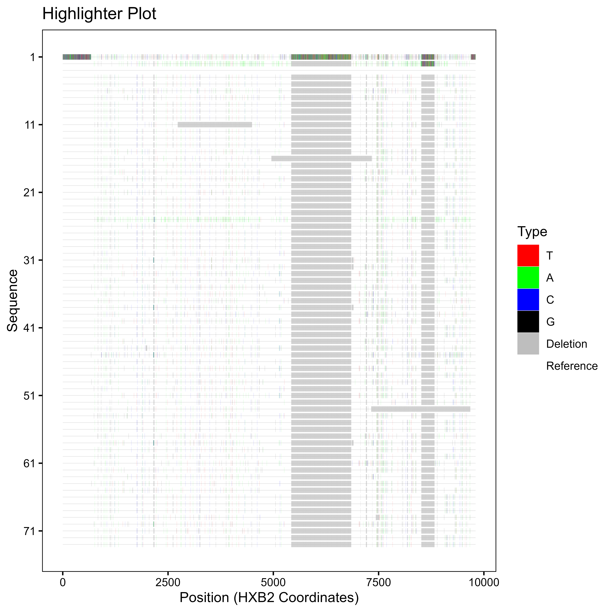

# Highlighter Plot
**Vivek Hariharan, 2024-01-09**

This R script is used to compare a set of DNA sequences to a reference sequence and visualize the differences using a plot.
This tool is heavily inspured by the [LANL Highlighter tool](https://www.hiv.lanl.gov/content/sequence/HIGHLIGHT/highlighter_top.html) in R.
The advantages to this repo over the LANL tool is that figures can be edited within the code and made to be publication-quality.

Notably, this script handles deletions differently than the LANL tool, as deletions are assessed prior to mutations from a reference. 

This application runs efficiently and can produce publication-quality plots. It is also easy to use and can be run on any computer with R installed.

Unfortunately, this application is not yet available as a package. However, it can be run by downloading the R script and running it in any R environment. The code in the repo is written in a Jupyter notebook.

Furthermore, there are some instances in the code where the user must manually change the code to fit their needs.

## How to use
Either clone or fork this repository and run the R script in any R environment.

## Input
The input is a pre-aligned FASTA or FAS file where every sequence is the same length. A reference sequence must be specified in the code based on its order in the file. The reference sequence is the sequence that all other sequences are compared to.

## Output
The output is a plot that shows the differences between the reference sequence and the other sequences. The plot is a line plot with the x-axis representing the position in the sequence. By default, the x-axis is scaled to the length of the alignment. The y-axis represents each individual sequence. The plot also has a legend that shows the color of each mutation and the base pair that it represents. Note that some colors in the legend are suppressed. 

## Example
The following is an example of the output of the script. The input is a FASTA file. FASTA and FAS files have been added to the .gitignore due to privacy and confidentiality concerns. This code can be run with any FASTA or FAS file.
**The reference sequence is set to sequence #3.** 
Apparently Github's markdown only supports PNGs and JPEGs. The PDF is in the repository. Therefore, the example will be switched to a PNG for use in this README.

Please do not utilize dark mode when viewing this image as the image is transparent and some features may not be visible.

## Dependencies
This script requires the following R packages:
* `ggplot2`
* `biostrings`

## Future Work
* Alter the input of sequences based on an input file i.e., CSV, .nwk, etc.

## Citation
Please cite this repository if you use or fork this repo.

## Acknowledgements
This script was inspired by the [LANL Highlighter tool](https://www.hiv.lanl.gov/content/sequence/HIGHLIGHT/highlighter_top.html). 
